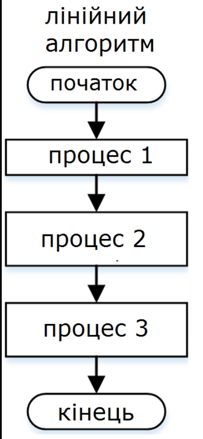
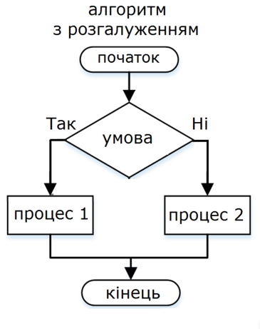
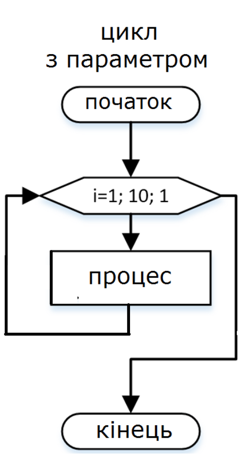
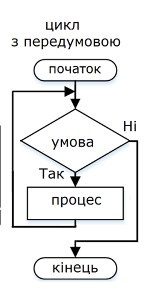
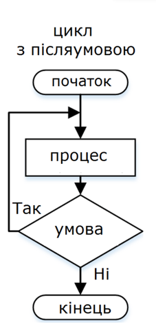
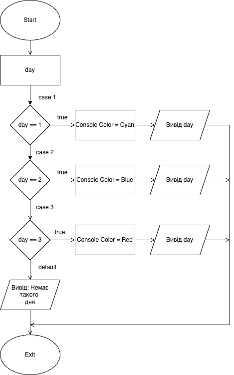

# Блок-схеми

Для того щоб полегшити процес розуміння і реалізації алгоритмів, часто використовуються **блок-схеми**.  
**Блок-схема** – це графічне зображення алгоритму, де кожна дія представлена у вигляді геометричної фігури, а стрілки
показують порядок виконання цих дій.

---

## Основні елементи блок-схеми

1. **Овал (еліпс)** – позначає **початок** і **кінець** алгоритму.
2. **Прямокутник** – використовується для позначення **операцій** або дій (обчислення, присвоєння тощо).
3. **Ромб** – використовується для позначення **перевірки умов** (так/ні).
4. **Паралелограм** – позначає операції **вводу або виводу даних**.
5. **Стрілки** – показують напрямок руху від одного кроку до іншого.
6. **Прямокутник із закругленим низом** – позначає **введення документа** або підготовку даних.
7. **Правильний шестикутник (Hexagon)** – використовується для позначення **циклів / ітерацій**.

---

## Приклад: алгоритм сортування трьох чисел

1. Порівняти перше і друге число. Якщо перше більше – поміняти місцями.
2. Порівняти друге і третє число. Якщо друге більше – поміняти місцями.
3. Порівняти перше і друге число ще раз. Якщо перше більше – поміняти місцями.

---

## Візуальні приклади блок-схем

Нижче наведено приклади зображень блок-схем

- **Проста блок-схема (початок, дія, кінець):**  
  

- **Блок-схема з умовою (if/else):**  
  

- **Блок-схема циклом з параметром:**  
  

- **Блок-схема циклом з передумовою:**  
  

- **Блок-схема циклом з післяумовою:**  
  

- **Блок-схема switch/case (приклад):**  
  
- 
---

## Переваги блок-схем

- **Візуальність** – легко зрозуміти навіть тим, хто не знає програмування.
- **Структурованість** – допомагають побачити логіку алгоритму.
- **Зручність пояснення** – можна використовувати для навчання чи презентацій.
- **Універсальність** – блок-схеми можна будувати для будь-якої сфери (математика, бізнес, техніка).

---

## Недоліки блок-схем

- **Займають багато місця** при зображенні складних алгоритмів.
- **Обмеженість у вираженні** – деякі складні алгоритми легше описати мовою програмування або псевдокодом.
- **Складність редагування** – при зміні алгоритму іноді доводиться переробляти всю схему.

---

## Поради з побудови блок-схем

1. Використовуйте **стандартні символи** – це робить схему зрозумілою для всіх.
2. **Не перевантажуйте схему** – краще розбивати складний алгоритм на кілька простих блоків.
3. Дотримуйтеся **єдиного напрямку** руху (зверху вниз або зліва направо).
4. Додавайте **пояснення** (написи поруч зі стрілками чи блоками).
5. Якщо алгоритм занадто великий – використовуйте **підсхеми** (окремі блоки для цілих процесів).

---

## Висновок

Блок-схеми є потужним інструментом для опису алгоритмів. Вони допомагають:

- швидко зрозуміти логіку задачі,
- уникати помилок під час розробки,
- пояснювати алгоритм іншим людям.

Хоча вони мають свої обмеження, блок-схеми залишаються одним із найпоширеніших методів візуалізації алгоритмів.
