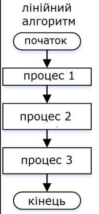
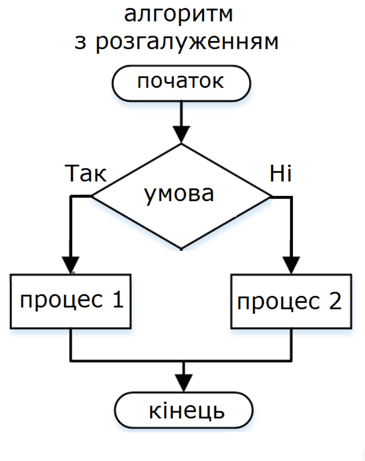
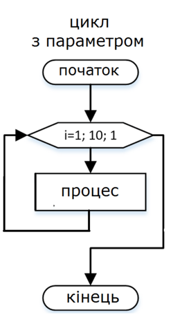
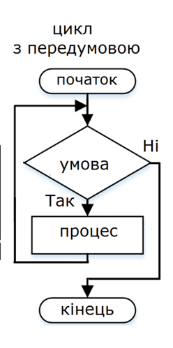
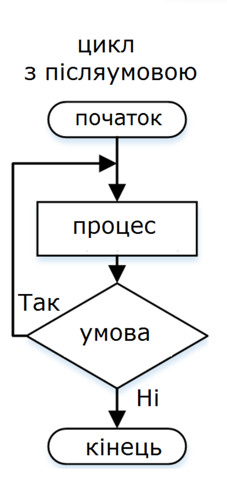
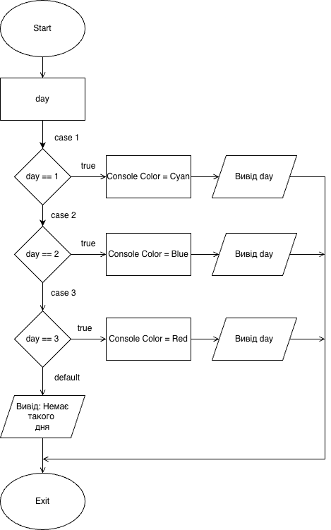

# Блок-схеми алгоритмів

Блок-схема — це креслення алгоритму. Так само, як інженер перед виготовленням деталі
робить креслення, програміст перед написанням складного алгоритму малює схему: на ній
видно всі шляхи виконання одразу, а помилка в логіці помітна ще до першого запуску.

Важливо, що позначення блок-схем **стандартизовані**. Це не довільні картинки: форми
фігур описані міжнародним стандартом **ISO 5807** (в Україні — ДСТУ, історично
ГОСТ 19.701-90). Завдяки цьому вашу схему прочитає будь-який програміст світу,
навіть не знаючи вашої мови.

## Основні фігури

| Фігура | Назва | Призначення | Скільки входів/виходів |
|--------|-------|-------------|------------------------|
| ⬭ Овал | Термінатор | Початок або кінець алгоритму | Початок: 0 входів, 1 вихід. Кінець: 1 вхід, 0 виходів |
| ▭ Прямокутник | Процес | Дія: обчислення, присвоєння | 1 вхід, 1 вихід |
| ▱ Паралелограм | Введення/виведення | Отримання даних або виведення результату | 1 вхід, 1 вихід |
| ◇ Ромб | Рішення | Перевірка умови | 1 вхід, **2 виходи**: «так» і «ні» |
| ⬡ Шестикутник | Підготовка | Заголовок циклу з лічильником | 1 вхід, 1 вихід |
| ▭ Прямокутник з подвійними боками | Визначений процес | Виклик підпрограми (функції) | 1 вхід, 1 вихід |
| ○ Коло | З'єднувач | Розрив лінії та її продовження в іншому місці | — |
| → Стрілка | Лінія потоку | Порядок виконання | — |

### На що звертати увагу

**Овал ставиться двічі** — на початку і в кінці. Схема без термінаторів вважається
незавершеною, навіть якщо все інше намальовано правильно.

**Прямокутник ≠ паралелограм.** Обидва «щось роблять», але прямокутник — це внутрішня
дія програми (`s = a + b`), а паралелограм — обмін даними із зовнішнім світом
(`ввести a`, `вивести s`). Плутати їх — найчастіша помилка в студентських роботах.

**З ромба завжди виходять рівно дві стрілки**, і обидві **обов'язково підписані**
«так»/«ні» (або «+»/«−», або «true»/«false»). Ромб з однією стрілкою — це не розгалуження,
а логічна помилка: алгоритм не знає, що робити при невиконанні умови.

**Дві стрілки не можуть входити в один блок збоку в довільний спосіб** — гілки
розгалуження мають явно з'єднатися перед наступним блоком.

## Правила побудови

1. **Єдиний напрямок.** Схема будується зверху вниз (або зліва направо). Стрілки, що
   йдуть проти основного напрямку, допускаються лише для повернення в циклі.
2. **Один вхід і один вихід.** Алгоритм має рівно один початок. Кінців формально може
   бути кілька, але хороший стиль — один.
3. **Усі стрілки з ромба підписані.** Без винятків.
4. **Блоки не перетинаються, лінії не перетинаються.** Якщо лінії неминуче перетинаються —
   схему треба перебудувати або скористатися з'єднувачами.
5. **Текст усередині блока — коротка дія**, а не абзац. Якщо не вміщається, дію
   треба розбити на кілька блоків або винести в підпрограму.
6. **Один блок — одна дія.** Не можна писати `ввести a, обчислити b, вивести b`
   в одному прямокутнику.
7. **Складний алгоритм розбивається на підсхеми.** Замість того щоб малювати сто блоків,
   позначають «визначений процес» і малюють його окремою схемою.

:::warning[Найчастіші помилки]
- Немає овалу «Кінець» — схема ніби обривається.
- З ромба виходить одна стрілка або стрілки не підписані.
- Дію введення намальовано прямокутником замість паралелограма.
- Цикл намальовано без стрілки повернення — виходить не цикл, а лінійна ділянка.
- В умові циклу немає жодної дії, яка змінює змінну умови — нескінченний цикл.
:::

## Приклади блок-схем

### Лінійний алгоритм

Найпростіша структура: блоки виконуються один за одним, розгалужень і повторень немає.



Такою схемою описують, наприклад, обчислення площі прямокутника: ввести `a`, ввести `b`,
обчислити `S = a · b`, вивести `S`.

### Розгалуження (if / else)

Ромб ділить потік на дві гілки, які потім знову з'єднуються.



Псевдокод цієї схеми:

```
якщо умова то
    дія 1
інакше
    дія 2
```

Важлива деталь: після виконання будь-якої з гілок алгоритм продовжується з **однієї
спільної точки**. Гілки не можуть закінчуватися «в нікуди».

### Цикл із лічильником (for)

Використовується, коли кількість повторень **відома заздалегідь**.



```
для i від 1 до n
    дія
```

Заголовок такого циклу позначають шестикутником: у ньому одразу записані початкове
значення, кінцеве значення і крок.

### Цикл з передумовою (while)

Умова перевіряється **перед** кожним виконанням тіла. Якщо вона хибна від початку,
тіло не виконається жодного разу.



```
поки умова
    дія
```

### Цикл з післяумовою (do…while)

Тіло виконується, **потім** перевіряється умова. Тому таке тіло виконається
щонайменше один раз — навіть якщо умова хибна одразу.



```
повторювати
    дія
поки умова
```

:::note[Різниця, яку часто плутають]
Цикл **з передумовою** може виконатися 0 разів. Цикл **з післяумовою** — щонайменше 1 раз.
Це не дрібниця: якщо алгоритм має спитати користувача хоча б раз (наприклад, «введіть
пароль»), потрібен цикл з післяумовою. Якщо обробляємо масив, який може виявитися
порожнім, — тільки з передумовою.
:::

### Вибір з кількох варіантів (switch / case)

Коли варіантів більше двох, замість ланцюжка ромбів використовують багатовихідний блок.



## Повний приклад: розв'язання задачі схемою

Побудуємо блок-схему для задачі: **ввести число і визначити, чи воно додатне,
від'ємне, чи дорівнює нулю**.

Крок 1 — постановка:

- дано: ціле число `n`;
- знайти: одне з трьох повідомлень;
- особливі випадки: нуль не є ні додатним, ні від'ємним.

Крок 2 — псевдокод:

```
початок
    ввести n
    якщо n > 0 то
        вивести "Додатне"
    інакше
        якщо n < 0 то
            вивести "Від'ємне"
        інакше
            вивести "Нуль"
кінець
```

Крок 3 — схема в текстовому вигляді (щоб побачити структуру до того, як малювати):

```
        ( Початок )
             │
        ▱ ввести n ▱
             │
        ◇ n > 0 ? ◇
        так │   │ ні
            │   └──────► ◇ n < 0 ? ◇
            │            так │   │ ні
            ▼                ▼   ▼
      ▱ "Додатне" ▱   ▱"Від'ємне"▱  ▱ "Нуль" ▱
            │                │   │
            └────────┬───────┴───┘
                     ▼
                 ( Кінець )
```

Крок 4 — той самий алгоритм на C#:

```csharp
int n = int.Parse(Console.ReadLine());

if (n > 0)
{
    Console.WriteLine("Додатне");
}
else if (n < 0)
{
    Console.WriteLine("Від'ємне");
}
else
{
    Console.WriteLine("Нуль");
}
```

Зверніть увагу, що `else if` у C# — це рівно той самий вкладений ромб зі схеми.
Мова просто дає коротший спосіб його записати.

## Переваги й недоліки блок-схем

**Переваги:**

- структура алгоритму видно одразу, без читання тексту;
- стандартні позначення — схему зрозуміє будь-який розробник;
- помилки в логіці (недосяжна гілка, відсутній вихід із циклу) видно візуально;
- не залежать від мови програмування.

**Недоліки:**

- займають багато місця: алгоритм на 50 рядків уже не вміщається на аркуш;
- складно редагувати — зміна одного блока часто вимагає перемалювати половину схеми;
- погано передають роботу з даними: масиви, об'єкти, структури на схемі не видно.

Через це в реальній розробці блок-схеми малюють не для всієї програми, а для окремих
нетривіальних алгоритмів — і для навчання, де головне зрозуміти структуру.

## Інструменти

Малювати схеми можна від руки, але для роботи зручніше:

| Інструмент | Особливості |
|------------|-------------|
| [draw.io](https://app.diagrams.net) | Безкоштовний, працює в браузері, має готовий набір фігур Flowchart |
| [Excalidraw](https://excalidraw.com) | Швидкі схеми «від руки», зручний для чернеток |
| Microsoft Visio | Промисловий стандарт, платний |
| PlantUML, Mermaid | Схема описується текстом і генерується автоматично — зручно зберігати в git |

:::tip
У draw.io набір потрібних фігур знаходиться в розділі **Flowchart** лівої панелі.
Не беріть фігури «на око» з інших наборів — візуально схожі фігури можуть мати
зовсім інше стандартне значення.
:::

## Висновок

- Блок-схема — **стандартизоване** графічне подання алгоритму (ISO 5807 / ДСТУ).
- Кожна фігура має чітке призначення: овал — межі, прямокутник — дія, паралелограм —
  введення/виведення, ромб — умова, шестикутник — заголовок циклу.
- З ромба завжди виходять **дві підписані** стрілки — це правило порушують найчастіше.
- Схема будується зверху вниз, лінії не перетинаються, один блок — одна дія.
- Блок-схеми незамінні для розуміння структури, але непридатні для великих програм.
