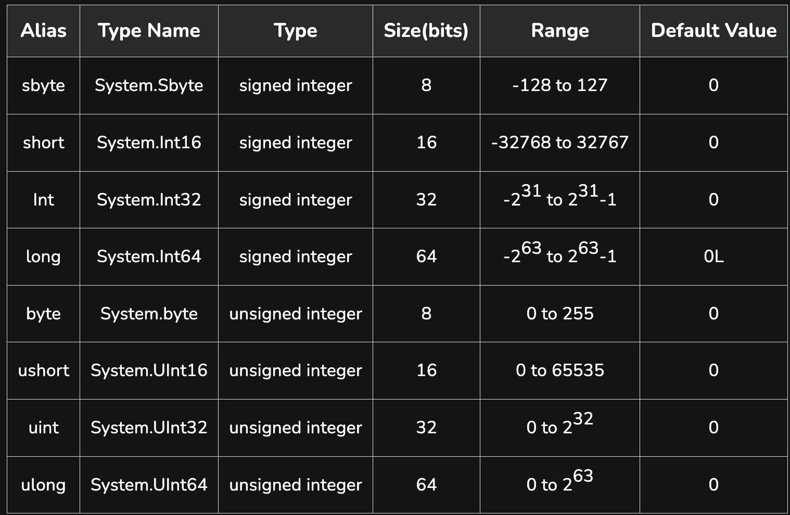

# Стандартні типи даних

У мові C# стандартні типи даних поділяються на **значимі (Value Types)** і **посилальні (Reference Types)**.

## Значимі типи

- **Цілі типи**:
    - `int`: 32-бітове ціле число.
    - `long`: 64-бітове ціле число.
    - `short`: 16-бітове ціле число.
    - `byte`: 8-бітове ціле число без знака.

- **Типи з плаваючою точкою**:
    - `float`: 32-бітове число з плаваючою точкою.
    - `double`: 64-бітове число з плаваючою точкою.
    - `decimal`: 128-бітове число для високоточних фінансових обчислень.

- **Інші типи**:
    - `char`: 16-бітовий символ Unicode.
    - `bool`: логічний тип, який може приймати значення `true` або `false`.

---

## Посилальні типи

- **Рядок (string)**: послідовність символів Unicode.
- **Об'єкт (object)**: базовий тип даних для всіх типів в C#.
- **Делегати, інтерфейси, масиви**: всі ці типи також є посилальними.

---

## Signed і Unsigned типи

### Signed типи

Знакові типи дозволяють представляти як **негативні**, так і **позитивні** числа.  
У пам'яті вони використовують один біт для зберігання знаку:

- `0` — позитивне число
- `1` — негативне число

### Unsigned типи

Беззнакові типи можуть представляти тільки **позитивні** числа і використовують усі біти для зберігання величини
числа.  
Це дозволяє зберігати більші значення за ту саму кількість біт.

---

### Коли використовувати signed і unsigned типи

- **Signed типи** — коли потрібно працювати з числами, які можуть бути як позитивними, так і негативними (наприклад,
  температура, рівень води).
- **Unsigned типи** — для зберігання тільки позитивних чисел, таких як:
    - лічильники (кількість елементів)
    - індекси масивів
    - дані, які за визначенням не можуть бути від'ємними (розміри файлів).

---

У програмуванні нам потрібні різні типи даних для зберігання чисел різного розміру, щоб оптимізувати використання
пам'яті та швидкість обробки. Різні типи даних виділяють різну кількість пам'яті для чисел, що дозволяє ефективніше
використовувати ресурси комп'ютера.

### Типи числових даних у C#:

- **short**:
    - Займає **16 біт** (2 байти).
    - Діапазон значень: від -32,768 до 32,767.
    - Використовується, коли нам потрібно зберігати невеликі цілі числа.
- **int** (відповідає **Integer**):
    - Займає **32 біти** (4 байти).
    - Діапазон значень: від -2,147,483,648 до 2,147,483,647.
    - Це найпоширеніший тип для цілих чисел, використовується в більшості випадків.
- **long**:
    - Займає **64 біти** (8 байтів).
    - Діапазон значень: від -9,223,372,036,854,775,808 до 9,223,372,036,854,775,807.
    - Застосовується для дуже великих чисел, коли **int** не може вмістити потрібне значення.

### Навіщо потрібні різні типи?

Різні типи даних дозволяють економно використовувати пам'ять. Якщо нам потрібно зберігати тільки невеликі числа, то
використання типу `short` допоможе зекономити пам'ять порівняно з використанням `int` або `long`. Однак, якщо ми
очікуємо дуже великі числа, нам краще обрати `long`.

### Як визначити, скільки біт займає число?

В C# кожен тип даних має чітко визначену кількість бітів, які він займає в пам'яті. Це залежить від діапазону значень,
які цей тип може представляти.

- Для **беззнакових типів** (наприклад, `ushort`, `uint`, `ulong`), всі біти використовуються для представлення лише
  позитивних чисел, що збільшує максимальний діапазон.

### Приклад:

Якщо у вас є значення 1000, його можна зберегти як у `short`, так і в `int` чи `long`. Але якщо число 3 мільярди, то
його можна зберегти лише в `int` чи `long`, оскільки воно не вміститься в `short`.
