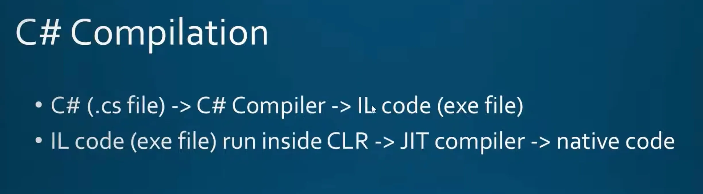
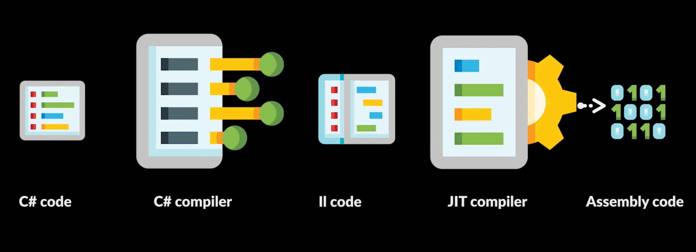
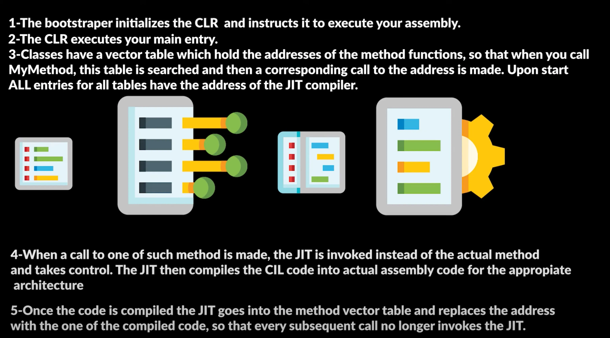

# Як працює .NET: компіляція, виконання та пам'ять

Ви написали текст програми. Між цим текстом і роботою процесора лежить механізм,
який варто розуміти — він пояснює, чому програма «підвисає» перші секунди після
запуску, чому чужий `.exe` на C# легко розібрати назад у код і чому вам не треба
вручну звільняти пам'ять.

Розберемо цей шлях по черзі: спочатку **як код стає програмою**, потім —
**як ця програма керує пам'яттю під час роботи**.

## Частина 1. Від коду до виконання

Процесор не розуміє C#. Він розуміє лише машинний код — послідовності байтів,
специфічні для конкретної архітектури. Перетворення тексту програми на щось,
що процесор виконає, називається **компіляцією**.

У C# цей шлях незвичний: він проходить у **два етапи**, і саме завдяки цьому
одна й та сама програма працює на Windows, Linux і macOS.

### Крок 1: C# → проміжний код (IL)

Коли ви натискаєте «Побудувати» у Visual Studio, компілятор **Roslyn**:

1. **Перевіряє синтаксис** — чи не порушені правила мови (забута `;`, незакрита дужка).
2. **Перевіряє типи** — чи не присвоюєте ви рядок цілому числу.
3. **Перекладає код** у **IL** (Intermediate Language, проміжна мова).
4. **Створює метадані** — опис усіх типів, методів і полів програми.
5. **Пакує результат** у **збірку** — файл `.exe` або `.dll`.

:::info[Що таке IL]
IL — це асемблер для уявного процесора, якого не існує в залізі. Він не прив'язаний
ні до x86, ні до ARM. Саме тому одна збірка працює на різних платформах:
під конкретний процесор код перекладається пізніше, вже на місці.
:::

Ось як виглядає IL для рядка `Console.WriteLine("Привіт!")`:

```
ldstr      "Привіт!"
call       void [System.Console]System.Console::WriteLine(string)
ret
```

Читати це не потрібно — важливо лише розуміти, що у `.exe` лежить **не** машинний
код, а ось такий проміжний.

### Крок 2: IL → машинний код (JIT)

Коли програму запускають, у справу вступає **CLR** (Common Language Runtime) —
середовище виконання .NET:

1. **Завантажує збірку** в пам'ять.
2. Коли метод викликається **вперше**, **JIT-компілятор** (Just-In-Time) перекладає
   його IL у машинний код цього конкретного процесора.
3. **Кешує** результат: при наступних викликах метод уже скомпільований і
   виконується напряму.
4. **Оптимізує** код під конкретне залізо.





:::tip[Чому JIT може бути швидшим за звичайну компіляцію]
Компілятор C++ створює код, що має працювати на будь-якому процесорі — отже,
орієнтується на найстаріший. JIT компілює на машині користувача і **знає**, який
там процесор, тому може використати сучасні інструкції. Звідси парадокс: попри
накладні витрати, .NET-код іноді випереджає заздалегідь скомпільований.
:::

### Чому програма «гальмує» перші секунди

Перший виклик кожного методу вимагає JIT-компіляції — звідси помітна затримка
під час запуску великих застосунків. Далі все працює на повній швидкості,
бо код уже скомпільований і закешований.

Це називають **проблемою холодного старту**, і для її вирішення існує AOT.

### AOT-компіляція

**AOT** (Ahead-of-Time) — компіляція IL у машинний код **заздалегідь**, до запуску.

| | JIT | AOT |
|---|-----|-----|
| Коли компілюється | Під час виконання | При побудові |
| Швидкість запуску | Повільніша | Швидка |
| Оптимізація під залізо | Так | Ні |
| Розмір файлу | Менший | Більший |
| Кросплатформність збірки | Так | Ні — під кожну платформу окремо |

AOT застосовують там, де критичний швидкий старт: мобільні застосунки,
хмарні функції, утиліти командного рядка.

### Роль CLR

CLR — це не лише JIT-компілятор, а повноцінна віртуальна машина, що відповідає за:

| Функція | Що робить |
|---------|-----------|
| Виконання коду | JIT-компіляція і запуск |
| Керування пам'яттю | Збирач сміття |
| Безпека типів | Перевірка коректності операцій під час виконання |
| Обробка винятків | Механізм `try/catch` — тема 14 |
| Керування потоками | Багатопотоковість — теми 29–32 |

Саме CLR абстрагує програму від операційної системи, і саме тому .NET
кросплатформний.

### Збірка (Assembly)

**Збірка** — результат компіляції, файл `.exe` або `.dll`.

| Розширення | Що це | Як запускається |
|------------|-------|-----------------|
| `.exe` | Застосунок із точкою входу `Main` | Запускається самостійно |
| `.dll` | Бібліотека класів | Підключається до інших проєктів |

Збірка містить IL-код, метадані та ресурси (зображення, тексти).

:::note[Чому чужий .NET-код легко «розібрати»]
Оскільки у збірці лежить IL із повними метаданими, спеціальні програми
(наприклад, ILSpy) відновлюють із неї читабельний код на C#, дуже близький
до оригіналу. Для захисту комерційного коду використовують **обфускатори** —
інструменти, що навмисно роблять імена й структуру нечитабельними.
:::

### Повна картина

```
   Program.cs  (ваш код на C#)
        │
        │  Компілятор Roslyn  — перевірка синтаксису й типів
        ▼
   MyApp.exe  (IL-код + метадані)      ← кросплатформний файл
        │
        │  CLR запускає, JIT компілює по методу
        ▼
   Машинний код                        ← під конкретний процесор
        │
        ▼
   Виконання процесором
```

### Помилки на різних етапах

Розуміння етапів допомагає читати помилки:

| Коли виникає | Вид помилки | Приклад |
|--------------|-------------|---------|
| Компіляція | Синтаксична, типів | `; expected`, `Cannot convert string to int` |
| Виконання | Виняток | `DivideByZeroException`, `NullReferenceException` |
| Не виникає сама | Логічна | Програма працює, результат неправильний |

Це рівно та класифікація помилок, яку ми ввели в темі 1 — тепер зрозуміло,
чому вони виявляються в різні моменти.

## Частина 2. Керування пам'яттю

Ця тема — одна з причин, чому C# вважають зручнішим за C++. Щоб зрозуміти, у чому
саме зручність, треба спершу побачити задачу, яку вона розв'язує.

### Проблема: хто прибирає за програмою

Коли програма створює об'єкт, під нього виділяється пам'ять. Коли об'єкт більше
не потрібен, пам'ять треба звільнити — інакше вона накопичуватиметься, і врешті
програма вичерпає доступну пам'ять. Це називають **витоком пам'яті** (memory leak).

Історично було два підходи:

| Підхід | Мова | Як працює | Ціна |
|--------|------|-----------|------|
| Ручний | C, C++ | Програміст сам викликає звільнення | Забув звільнити — витік. Звільнив двічі — аварія |
| Автоматичний | C#, Java, Python | Середовище саме знаходить непотрібне | Невеликі непередбачувані паузи |

C# обрав другий шлях. Механізм, що цим займається, називається **збирачем сміття**
(Garbage Collector, GC).

### Де взагалі зберігаються дані

Пам'ять програми поділена на дві області з різними правилами.

#### Стек (Stack)

- зберігає локальні змінні значимих типів і параметри методів;
- працює за принципом «останній прийшов — перший пішов»;
- звільняється **автоматично**, щойно метод завершився;
- дуже швидкий, але невеликий (близько 1 МБ).

#### Купа (Heap)

- зберігає об'єкти посилальних типів, створені через `new`;
- розмір обмежений лише оперативною пам'яттю;
- повільніша за стек;
- **саме тут працює збирач сміття**.

```csharp
void Example()
{
    int number = 42;                    // значення — у стеку
    int[] data = new int[1000];         // посилання у стеку, сам масив — у купі

}   // метод завершився: number зник разом зі стеком,
    // масив у купі залишився, доки до нього є посилання
```

:::note
Детально стек і купа розглядаються в темі 3 разом зі значимими й посилальними
типами. Тут достатньо розуміти, що GC працює **тільки з купою**.
:::

### Як GC визначає, що об'єкт більше не потрібен

Ключове поняття — **досяжність**. Об'єкт потрібен, якщо до нього можна дістатися
ланцюжком посилань від «коренів»: локальних змінних активних методів, статичних полів,
регістрів процесора.

```csharp
var person = new Person("Олена");   // об'єкт досяжний через змінну person
person = null;                      // посилання зникло — об'єкт став недосяжним
                                    // тепер GC може його зібрати
```

Алгоритм має назву **Mark-and-Sweep** («познач і підмети») і працює у два кроки:

1. **Mark** — GC обходить усі корені й позначає кожен досяжний об'єкт як «живий».
2. **Sweep** — усе, що не позначене, вважається сміттям, і його пам'ять звільняється.

Після цього виконується **компактування**: живі об'єкти зсуваються докупи, щоб
не залишалося «дірок» вільної пам'яті між ними.

:::tip[Чому не рахувати посилання]
Простіший підхід — рахувати, скільки посилань веде на об'єкт, і звільняти при нулі.
Він ламається на **циклічних посиланнях**: два об'єкти посилаються один на одного,
лічильники ненульові, але ззовні до них ніхто не дістанеться. Mark-and-Sweep
цю проблему не має, бо орієнтується на досяжність від коренів, а не на лічильники.
:::

### Покоління

Обходити всю купу щоразу — дорого. GC використовує спостереження: **більшість
об'єктів живуть дуже недовго** (створили в методі, метод завершився — об'єкт уже
не потрібен).

Тому купа поділена на три **покоління**:

| Покоління | Що містить | Як часто перевіряється |
|-----------|-----------|------------------------|
| **Gen 0** | Щойно створені об'єкти | Найчастіше — швидка перевірка |
| **Gen 1** | Ті, що пережили одне збирання | Рідше |
| **Gen 2** | Довгожителі | Найрідше — найдорожча перевірка |

Об'єкт, що пережив збирання в Gen 0, переводиться в Gen 1, потім у Gen 2.
Оскільки більшість «помирає» молодими, часта перевірка лише Gen 0 прибирає
основну масу сміття дешево.

### Коли запускається GC

- коли в купі бракує місця для нового об'єкта;
- коли обсяг виділеної пам'яті перевищив поріг;
- за явним викликом `GC.Collect()`.

:::warning
`GC.Collect()` викликати вручну **не треба**. Збирач знає про стан пам'яті більше
за вас, а примусовий виклик спричиняє повну зупинку програми й зазвичай погіршує
продуктивність. Це один з тих випадків, коли найкраща дія — не робити нічого.
:::

### Чого GC не вміє

Збирач сміття керує **керованою** пам'яттю .NET. Він нічого не знає про ресурси
операційної системи: відкриті файли, мережеві з'єднання, підключення до баз даних.

Для них використовують конструкцію `using`, яка гарантовано звільняє ресурс
при виході з блока:

```csharp
using (var reader = new StreamReader("data.txt"))
{
    string text = reader.ReadToEnd();
    Console.WriteLine(text);
}   // файл гарантовано закрито тут — навіть якщо сталася помилка
```

Детально роботу з файлами розглянемо в темі 13.

### Переваги й недоліки автоматичного керування

**Переваги:**

- програміст не витрачає час на ручне звільнення пам'яті;
- неможливі цілі класи помилок: подвійне звільнення, звернення до звільненої пам'яті;
- витоки пам'яті трапляються значно рідше.

**Недоліки:**

- **непередбачувані паузи**: під час збирання програма ненадовго зупиняється;
- більше споживання пам'яті: сміття лежить у купі до наступного збирання;
- менший контроль — не можна точно сказати, коли об'єкт буде знищено.

:::info[Де це має значення]
Для звичайних застосунків паузи GC (частки мілісекунди) непомітні. Але у відеоіграх,
де кадр має вкластися у 16 мс, пауза GC викликає «підвисання» картинки. Тому
розробники на Unity спеціально пишуть код так, щоб створювати менше сміття.
:::

### Що з цього треба запам'ятати зараз

Ви не будете керувати GC у цьому курсі — у цьому й сенс автоматичного керування.
Практичних висновків для вас рівно три:

1. Створені об'єкти звільняються **самі** — про це не треба думати.
2. `GC.Collect()` вручну не викликати.
3. Для файлів і з'єднань використовувати `using` — GC їх не прибере.

## Висновок

**Компіляція і виконання:**

- Компіляція в C# **двоетапна**: спочатку C# → **IL**, потім під час виконання
  IL → **машинний код** через **JIT**.
- У файлі `.exe` лежить **IL, а не машинний код** — саме тому .NET кросплатформний
  і саме тому збірку можна розібрати назад у читабельний код.
- **CLR** — віртуальна машина, що виконує код, керує пам'яттю, типами й винятками.
- **JIT** компілює кожен метод при першому виклику й кешує результат — звідси
  затримка на старті; **AOT** компілює заздалегідь, жертвуючи кросплатформністю.

**Пам'ять:**

- **Стек** зберігає локальні значення й звільняється автоматично при виході
  з методу; **купа** зберігає об'єкти, і саме в ній працює збирач сміття.
- Об'єкт вважається сміттям, коли він **недосяжний** від коренів.
- Алгоритм **Mark-and-Sweep** позначає живі об'єкти й звільняє решту;
  **покоління** (Gen 0/1/2) роблять часті перевірки дешевими.
- GC не звільняє **некеровані ресурси** — файли й з'єднання закривають через `using`.
- Ціна автоматичного керування — **непередбачувані короткі паузи**.
