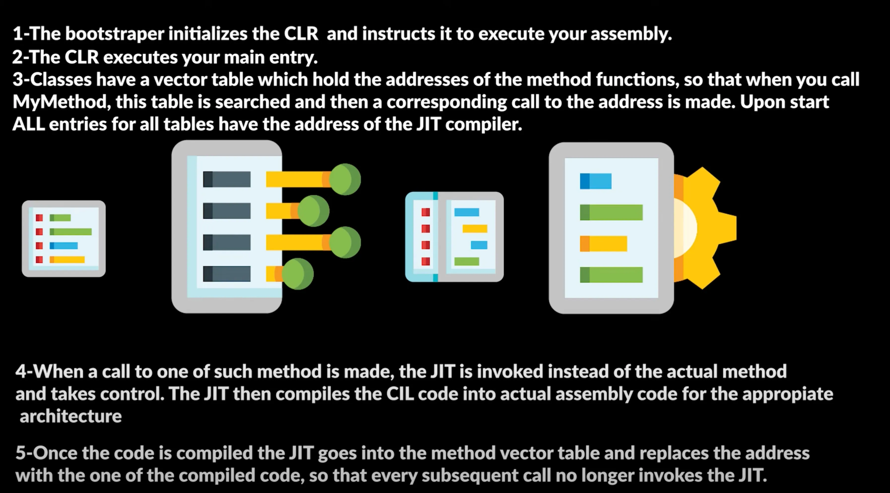

# Компіляція у C#

Компіляція C# у машинний код є важливою частиною процесу виконання програми, і вона включає кілька ключових етапів. Ось
як це відбувається:

---

## 1. Написання коду

Розробник пише вихідний код на C# у текстовому редакторі або інтегрованому середовищі розробки (IDE), наприклад, Visual
Studio. Код може включати класи, методи, змінні та інші елементи мови програмування.

---

## 2. Компіляція в проміжний код (Intermediate Language, IL)

* **Синтаксичний аналіз**: Коли розробник компілює код, компілятор перевіряє його на синтаксичні та граматичні помилки.
* **Перетворення в IL**: Після перевірки синтаксису, код компілюється в проміжний мовний код (IL або MSIL). IL — це
  платформи незалежна кодова форма, яка не є машинним кодом, а є абстрактним кодом, що може бути перетворений у машинний
  код пізніше.
* **Створення метаданих**: Під час компіляції також створюються метадані, які описують структуру програми, типи, методи
  та інші елементи.
* **Збірка (Assembly)**: Результатом компіляції є збірка, що містить IL код, метадані та, можливо, ресурси (зображення,
  файли тощо). Збірка зазвичай має розширення `.exe` або `.dll`.

---

## 3. Виконання та JIT-компіляція

* **Завантаження збірки**: Коли програма запускається, .NET Common Language Runtime (CLR) завантажує збірку у пам'ять.
* **Just-In-Time (JIT) компіляція**: На цьому етапі Just-In-Time компілятор (JIT) перетворює IL код у машинний код.
  JIT-компілятор компілює IL код безпосередньо в код, який може бути виконаний процесором. Цей процес відбувається в
  момент виконання програми, тобто тоді, коли метод або функція викликається вперше.
* **Кешування машинного коду**: JIT-компілятор може кешувати згенерований машинний код для повторного використання, що
  знижує накладні витрати на повторну компіляцію одного і того ж коду.
* **Оптимізація**: JIT-компілятор також може виконувати оптимізації машинного коду, наприклад, оптимізацію швидкості
  виконання або використання регістрів процесора.

---

## Підсумки

* **Перетворення в IL**: Спочатку код C# компілюється в проміжний мовний код IL.
* **JIT-компіляція**: Під час виконання програми IL код компілюється в машинний код за допомогою JIT-компілятора.
* **Виконання машинного коду**: Машинний код виконується процесором, що дозволяє програмі працювати на конкретному
  апаратному забезпеченні.
* **Кешування та оптимізація**: JIT-компілятор може кешувати згенерований код і виконувати оптимізації для підвищення
  продуктивності.

Цей процес дозволяє C# програмам бути портативними (завдяки IL) та ефективно виконуваними на різних платформах завдяки
JIT-компіляції.

---

### Додаткова інформація про компіляцію

Описаний вище процес є базовим, але варто звернути увагу на декілька додаткових аспектів, які можуть бути корисними для
більш глибокого розуміння.

**1. AOT-компіляція (Ahead-of-Time)**
Хоча JIT-компіляція є стандартом для .NET, існує також AOT-компіляція, коли весь IL-код перетворюється в машинний код ще
до запуску програми. Це дозволяє прискорити запуск програми, оскільки JIT-компілятору не потрібно витрачати час на
перетворення коду під час виконання. AOT-компіляція часто використовується для мобільних та вбудованих додатків, де
важливий швидкий старт.

**2. Garbage Collection (Збирання сміття)**
.NET CLR також містить автоматичний збирач сміття (Garbage Collector). Це важлива частина "середовища виконання", що
управляє пам'яттю. Замість того, щоб розробник вручну виділяв і звільняв пам'ять (як, наприклад, у C++), Garbage
Collector автоматично знаходить невикористані об'єкти і очищає пам'ять. Це допомагає запобігти витокам пам'яті та значно
спрощує розробку.

**3. Роль CLR**
Common Language Runtime (CLR) — це не просто JIT-компілятор. Це ціла віртуальна машина, яка забезпечує виконання коду.
Вона керує потоками, безпекою, обробкою винятків та, як вже згадувалося, пам'яттю. Саме CLR є основою крос-платформності
.NET, оскільки вона абстрагує програму від конкретної операційної системи.

Розуміння цих процесів дозволяє програмістам писати більш ефективний та оптимізований код, враховуючи, як саме він буде
виконуватися.

