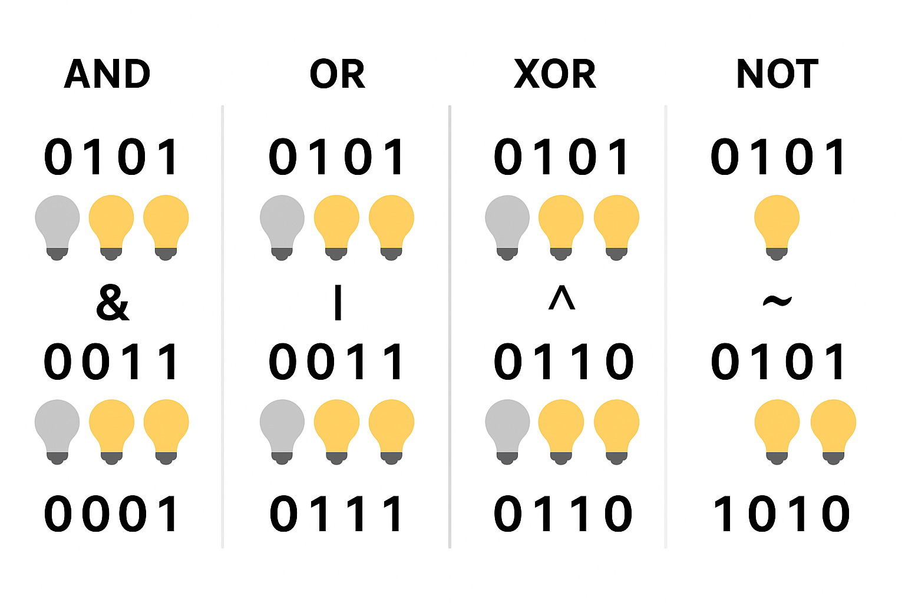

# Побітові операції

## Що таке побітові операції

**Побітові операції** — це операції, які виконуються **над окремими бітами** двійкового представлення чисел.  
Тобто вони працюють не з цілими числами як з одним значенням, а з **кожним бітом числа окремо**.

Наприклад:

- 5 (в двійковій системі) = 0101
- 3 (в двійковій системі) = 0011

---

## Основні побітові оператори в C#

| Оператор | Назва                       | Опис                                                      |
|----------|-----------------------------|-----------------------------------------------------------|
| `&`      | Побітове І (AND)            | Повертає 1 лише якщо обидва біти дорівнюють 1             |
| `\|`     | Побітове АБО (OR)           | Повертає 1 якщо хоча б один з бітів дорівнює 1            |
| `^`      | Побітове виключне АБО (XOR) | Повертає 1, якщо біти різні                               |
| `~`      | Побітове НЕ (NOT)           | Інвертує всі біти (1 → 0, 0 → 1)                          |
| `<<`     | Зсув вліво                  | Зсуває всі біти числа вліво на вказану кількість позицій  |
| `>>`     | Зсув вправо                 | Зсуває всі біти числа вправо на вказану кількість позицій |

---

## Навіщо потрібні побітові операції

Побітові операції дозволяють:

- **Економити пам’ять** — часто використовуються для збереження кількох логічних прапорців (true/false) в одному числі.
- **Швидко обробляти дані** — вони працюють набагато швидше, ніж арифметичні або логічні операції високого рівня.
- **Оптимізувати продуктивність** у системному та низькорівневому програмуванні (драйвери, мікроконтролери, мережеві
  протоколи).
- **Маніпулювати окремими бітами** — коли потрібно перевірити або змінити лише одну частину даних (наприклад, певний
  розряд у числі).

---

## Коли та як їх використовують

Поширені приклади застосування:

1. **Прапорці станів (bit flags)**
    - Зберігання множини логічних значень в одному числі.
    - Використовуються у налаштуваннях, режимах роботи, станах об'єктів.
    - Наприклад:
        - `0001` — прапорець "увімкнено звук"
        - `0010` — прапорець "увімкнено відео"
        - `0100` — прапорець "повноекранний режим"
   ```csharp
   [Flags]
   enum Settings
   {
      None = 0,
      Sound = 1,       // 0001
      Video = 2,       // 0010
      Fullscreen = 4   // 0100
   }
      
   class Program
   {
      static void Main()
      {
          Settings current = Settings.Sound | Settings.Video; // Увімкнено звук і відео
          Console.WriteLine(current); // Виведе: Sound, Video
      }
   }
   ```

2. **Перевірка конкретного біта**
    - `(value & mask) != 0` — перевіряє, чи встановлений певний біт
   ```csharp
   int value = 5;  // 0101
   int mask = 1;   // 0001
   
   bool isBitSet = (value & mask) != 0;
   
   Console.WriteLine(isBitSet); // True — перший біт увімкнено
   ```

3. **Увімкнення або вимкнення конкретного біта**
    - `value |= mask` — увімкнути біт
    - `value &= ~mask` — вимкнути біт
   ```csharp
   int value = 4;    // 0100
   int mask = 1;     // 0001
   
   // Увімкнути біт
   value |= mask;    // Тепер value = 0101 (5)
   
   // Вимкнути біт
   value &= ~mask;   // Тепер value = 0100 (4)
   ```

4. **Зсуви бітів**
    - Застосовуються для швидкого множення або ділення на степені двійки:
        - `x << 1` — множення на 2
        - `x >> 1` — ділення на 2
   ```csharp
   int x = 3;       // 0011

   int multiplied = x << 1;  // 0110 (6) — множення на 2
   int divided = x >> 1;     // 0001 (1) — ділення на 2
   
   Console.WriteLine(multiplied);
   Console.WriteLine(divided);
   ```

---



## Базові операції

1. Побітове І (& — AND)

   Правило: повертає 1 тільки якщо обидва біти дорівнюють 1. Інакше результат — 0.

   Приклад:
   ```
     0101   (5)
   & 0011   (3)
   ------------
     0001   (1)
   
   Пояснення:
   0 & 0 = 0
   0 & 1 = 0
   1 & 0 = 0
   1 & 1 = 1 ✅
   ```

   > Використовується, щоб зберегти тільки ті біти, які встановлені в обох числах.
   > Наприклад, перевірка конкретного прапорця.

2. Побітове АБО (| — OR)

   Правило: повертає 1, якщо хоча б один біт дорівнює 1. Інакше — 0.

   Приклад:
   ```
     0101   (5)
   | 0011   (3)
   ------------
     0111   (7)
   
   Пояснення:
   0 | 0 = 0
   0 | 1 = 1 ✅
   1 | 0 = 1 ✅
   1 | 1 = 1 ✅
   ```
   > Використовується, щоб увімкнути біти, не змінюючи інші.

3. Побітове виключне АБО (^ — XOR)
   Правило: повертає 1, якщо біти різні (0 та 1 або 1 та 0),
   і 0, якщо біти однакові.

   Приклад:
   ```
     0101   (5)
   ^ 0011   (3)
   --------
     0110   (6)
   
   Пояснення:
   0 ^ 0 = 0
   0 ^ 1 = 1 ✅
   1 ^ 0 = 1 ✅
   1 ^ 1 = 0
   ```
   > Використовується, щоб перемикати певні біти або для простого шифрування.

4. Побітове НЕ (~ — NOT)
   Правило: перевертає всі біти числа:
   0 → 1, 1 → 0.

   Приклад (для 4 біт):
   ```
     0101   (5)
   ~ 0101
   --------
     1010   (-6 у двійковому представленні з доповненням до двійки)
   
   Пояснення:
   
   Кожен біт змінюється на протилежний.
   У C# це дає доповнення до двійки, тому десяткове число стає від’ємним для цілих типів.
   ```
   > Використовується, щоб інвертувати біти, наприклад для масок або перевірок.

## Реальні задачі для побітових операцій

- **Системне програмування:** маніпуляція окремими бітами регістрів або портів введення-виведення.
- **Ігрова розробка:** зберігання станів клавіш, гравця або об'єктів у вигляді наборів бітів.
- **Графіка:** змішування або фільтрація кольорів, коли кожен байт відповідає за окремий канал (RGBA).
- **Мережеві протоколи:** складання або розбирання заголовків пакетів (де кожен біт має своє значення).
- **Компресія даних:** ущільнення логічної інформації в мінімальну кількість бітів.

---
